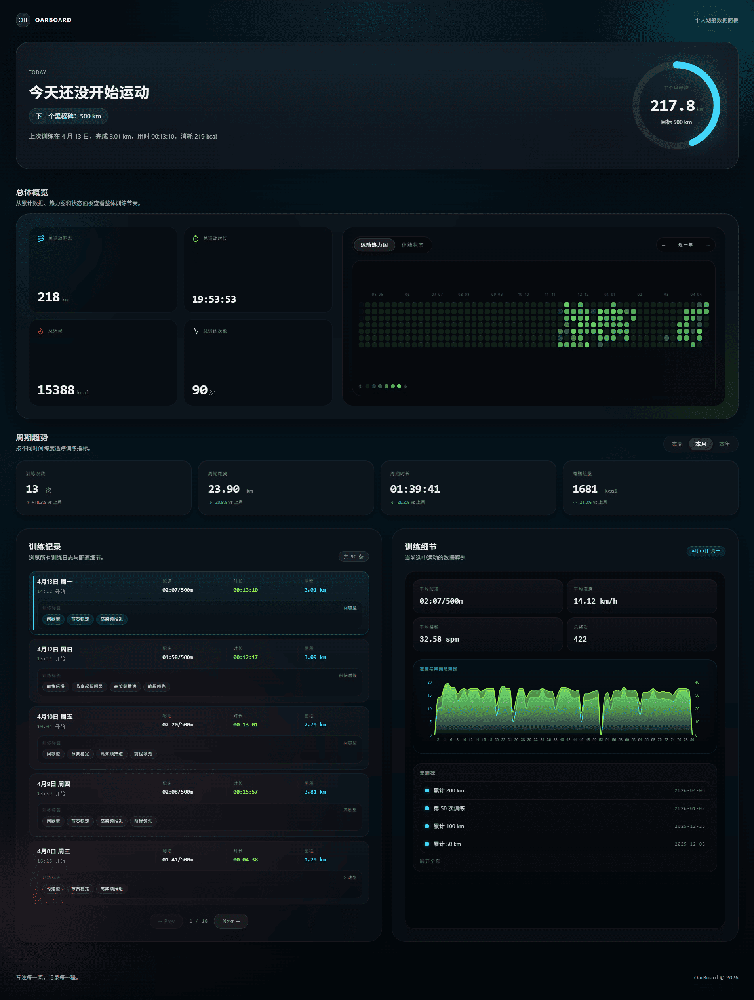
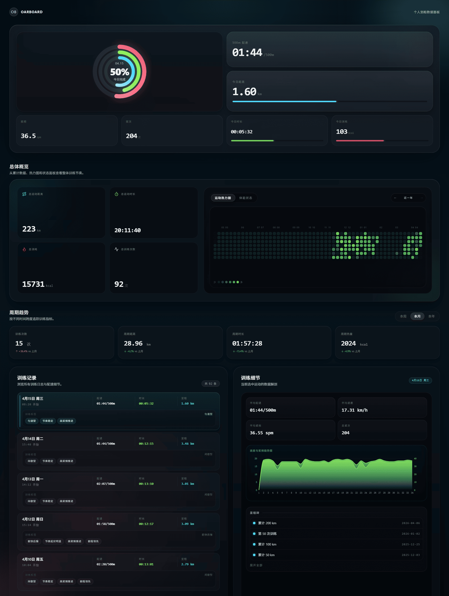

# OarBoard

一个基于 Next.js 16 的划船数据可视化面板。

数据来源：「摩刻健身」App 划船训练，将自己的训练数据单独做成了一个网页 dashboard

这个项目整体视觉风格参考了 Apple Fitness，包含首页概览、实时数据看板、日历热力图和训练详情图表。

如果你也在用摩刻健身记录划船数据，想把数据整理得更直观一点，这个项目也许能给你一些参考。

## Preview

<p align="center">
  
  
</p>

## Data Source

这个项目的数据并不是来自官方公开 API，而是我通过抓包整理「摩刻健身」App 的请求后，提取出自己账号可访问的数据接口，再用于个人划船训练数据的展示和分析。

目前这个项目主要服务于我自己的训练记录，但如果你也有类似需求，也可以基于自己的账号数据进行配置和使用。

项目中**不会提供任何现成可用的账号信息或授权参数**，你需要自行获取对应配置。

不会 Flutter 抓包的可以参考这篇文章：[Flutter 抓包终极指南：使用 reFlutter + TunProxy + Burp Suite 绕过 SSL Pinning](https://xwuxl.com/2026/03/31/flutter-traffic-capture-reflutter-burp-suite-guide/)


## Getting Started

先安装依赖：

```bash
npm install
````

启动开发环境：

```bash
npm run dev
```

然后打开：

```bash
http://localhost:3000
```

## Environment Variables

配置下面三个环境变量参数：

```bash
MOKE_ACCOUNT_ID=your-account-id
MOKE_AUTHORIZATION=your-token-here
MOKE_BASE_URL=http://data.mokfitness.cn
```

这三个值都需要你**自己通过抓包获取**。

参数说明：

* `MOKE_ACCOUNT_ID`：当前账号对应的用户标识
* `MOKE_AUTHORIZATION`：接口请求所需的授权信息
* `MOKE_BASE_URL`：接口基础地址

## How It Works

项目通过 `/api/moke/[...path]` 作为服务端代理去请求接口。

这样处理主要有两个目的：

* `MOKE_AUTHORIZATION` 只在服务端读取，不直接暴露到前端
* 前端通过代理接口获取数据，便于统一处理请求和错误状态

其中：

* `MOKE_AUTHORIZATION` 用于服务端代理请求时携带授权信息
* `MOKE_ACCOUNT_ID` 用于拉取当前用户相关训练数据

如果 token 失效或授权不可用，请求会返回鉴权错误，页面也会显示对应提示，提醒你更新 `MOKE_AUTHORIZATION`。

## Deploy on Vercel

如果你准备部署到 Vercel，需要在项目设置里补上同样的环境变量：

* `MOKE_ACCOUNT_ID`
* `MOKE_AUTHORIZATION`
* `MOKE_BASE_URL`

## Scripts

```bash
npm run dev
npm run build
npm run typecheck
```

## Notes

* 这个项目基于我当前抓到的接口整理而成，后续如果摩刻健身 App 接口有变化，项目可能也需要跟着调整
* `MOKE_AUTHORIZATION` 可能会过期，失效后需要重新抓取
* 目前主要围绕划船训练数据做展示，其他类型训练数据不一定完整适配
* 建议仅用于查看和整理你自己的训练数据
